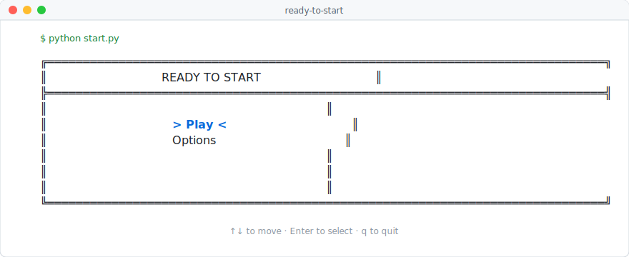

# Ready to Start

<p align="center">
  <picture>
    <source media="(prefers-color-scheme: dark)" srcset="docs/images/splash-dark.svg">
    
  </picture>
</p>

A terminal puzzle game about settings menus. There's a "Play" button.
It's locked. To unlock it, you have to configure the settings. To
configure a setting, you have to configure the *other* setting it
depends on. Repeat until you find the one thread you can pull.

> Status: working alpha. Twenty procedurally generated levels, playable
> end to end. Rough edges remain.

## What

- A curses-based TUI where every level is a small graph of settings
  with hidden dependencies between them.
- Each menu has one root setting whose dependencies are already met.
  Find it, enable it, and the next link in the chain unlocks. Follow
  the thread until everything is configured.
- Levels are generated from a seed, so the same seed always produces
  the same puzzle.

## Why

Because the joke writes itself: a game whose entire content is the
settings menu you'd usually skip past. The mechanic underneath — find
the unmet-dep root, unravel the chain — is a small dependency-graph
puzzle dressed up as software-configuration tedium.

## How it plays

- You start in a menu of disabled settings.
- Pressing Enter on a setting whose dependencies aren't met shows a
  hint about what to configure first.
- Exactly one setting per menu has no unmet dependencies — that's the
  thread. Enable it, and the next setting becomes reachable.
- Later levels add more menus; use ←/→ to move between them.
- A level is complete when every setting is enabled. There are 20
  levels of increasing size.

## Get started

Requires Python 3.11+ and a terminal that supports ncurses (any normal
Linux/macOS terminal; on Windows use WSL).

One-liner from a fresh clone:

```bash
python3 -m venv .venv && source .venv/bin/activate && pip install -r requirements.txt && python start.py
```

After the first time, just:

```bash
source .venv/bin/activate && python start.py
```

### Controls

| Key | Action |
|---|---|
| ↑ ↓ / w s / k j | Move selection |
| ← → / a d | Previous / next menu |
| Enter | Edit selected setting |
| `:` | Command mode |
| `h` | Help |
| `q` | Quit |

## Project layout

```
start.py            Entry point (hub menu + level runner)
src/core/           Settings, menus, dependencies, game state
src/generation/     Procedural level generation (WFC, Mad Libs, deps)
src/ui/             Curses rendering, navigation, setting editors
src/testing/        Test harnesses, including the scripted player
config/             INI configs (levels, difficulty, UI, messages)
data/               JSON content (templates, categories)
scripts/            CLI tools (see below)
tests/              pytest suite
```

### Useful scripts

- `python scripts/headless_play.py --level Level_3 --seed 42` — solve
  a level without curses; reports victory or which settings are stuck.
- `python scripts/scripted_play.py --level Level_3 --seed 42 --auto-solve` —
  drive the real UI loop with simulated keypresses (used to reproduce
  UI bugs without a terminal).
- `python scripts/check_solvability.py --seed 1 --count 10` — sanity
  check that generated games are solvable.

## Development

```bash
pip install -e ".[dev]"   # install dev tools
pytest                    # run the test suite
black src tests           # format
ruff check src tests      # lint
```

## License

MIT — see [LICENSE](LICENSE).
